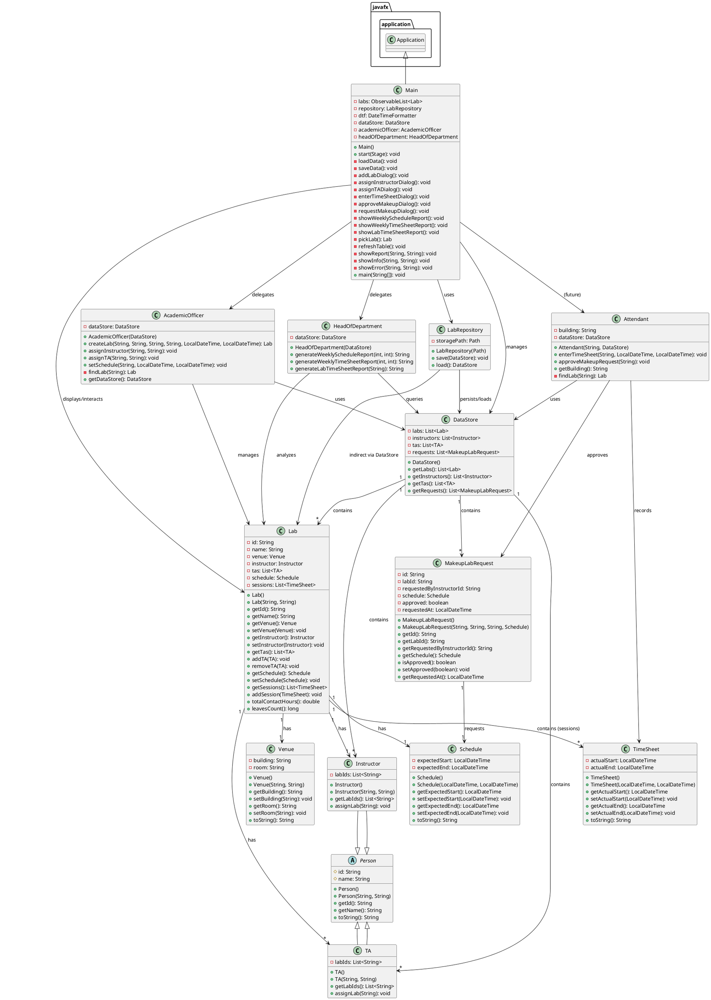

# Class Diagram & Architecture Explanation

## Class Hierarchy & Relationships

### PlantUML Class Diagram



---

## Architecture Layers

### 1. **Domain Model Layer** (Core Business Logic)
Classes: `Person`, `Instructor`, `TA`, `Lab`, `Venue`, `Schedule`, `TimeSheet`, `MakeupLabRequest`

**Responsibility**: Represent domain entities with minimal behavior.
- All classes are serializable (`implements Serializable`)
- Encapsulate data with getters/setters
- Minimal business logic (mostly accessors)
- Example: `Lab.totalContactHours()` computes from session list

**SOLID Principles Applied**:
- **Single Responsibility**: Each class represents one concept
- **Open/Closed**: Can extend `Person` for new person types without modifying base

### 2. **Persistence Layer** (Data Access)
Classes: `LabRepository`, `DataStore`

**Responsibility**: Abstract I/O operations.
- `LabRepository`: Reads/writes `DataStore` to binary file (`data/datastore.dat`)
- `DataStore`: Container holding all domain lists (labs, instructors, TAs, requests)
- Uses Java's `ObjectInputStream`/`ObjectOutputStream` (no SQL)

**SOLID Principles Applied**:
- **Single Responsibility**: Only handles serialization
- **Dependency Inversion**: Clients depend on `LabRepository` interface, not file paths

### 3. **Service Layer** (Business Logic & Workflows)
Classes: `AcademicOfficer`, `Attendant`, `HeadOfDepartment`

**Responsibility**: Implement business processes and queries.

#### `AcademicOfficer`
- Create labs
- Assign instructors and TAs
- Set schedules
- Operates on `DataStore` passed to constructor

#### `Attendant`
- Record actual timesheet entries
- Approve/reject makeup requests
- Tracks building assignment

#### `HeadOfDepartment`
- Generate three required reports:
  1. Weekly schedule (by year/week)
  2. Weekly timesheet (actual sessions by year/week)
  3. Lab semester report (full session history with totals, absences, makeup info)

**SOLID Principles Applied**:
- **Single Responsibility**: Each service handles one domain responsibility
- **Interface Segregation**: Each service exposes only needed methods
- **Open/Closed**: New report types can be added without modifying existing code
- **Dependency Inversion**: Services receive `DataStore` (abstraction), not concrete UI

### 4. **Presentation Layer** (User Interface)
Classes: `Main` (JavaFX Application)

**Responsibility**: User interaction and orchestration.
- Displays lab table with columns (ID, Name, Venue, Instructor, TAs)
- Provides dialogs/buttons for:
  - CRUD operations (add lab, assign instructor/TA)
  - Workflow operations (enter timesheet, request/approve makeup)
  - Report generation
- Syncs in-memory state with disk (load/save via `LabRepository`)
- Delegates business logic to services

**SOLID Principles Applied**:
- **Single Responsibility**: UI only handles presentation and user input routing
- **Dependency Inversion**: Depends on services (abstractions), not directly on entities

---

## Data Flow Example: Enter TimeSheet

```
User clicks "Enter TimeSheet"
  ↓
Main.enterTimeSheetDialog() invoked
  ↓
User selects lab from list (pickLab)
  ↓
Dialog prompts for actual start/end times
  ↓
User enters times, clicks OK
  ↓
Main creates TimeSheet object
  ↓
Main adds TimeSheet to selected Lab.addSession()
  ↓
Lab.totalContactHours() and Lab.leavesCount() now reflect new session
  ↓
User clicks "Save"
  ↓
Main calls repository.save(dataStore)
  ↓
LabRepository serializes DataStore (including all labs with sessions) to data/datastore.dat
```

---

## Design Patterns Used

### 1. **Repository Pattern** (`LabRepository`)
Abstracts data access. Clients never directly interact with files; all I/O goes through this interface.

### 2. **Service Locator / Dependency Injection** (in `Main`)
Services are instantiated with `DataStore` dependency:
```java
dataStore = new DataStore();
academicOfficer = new AcademicOfficer(dataStore);
headOfDepartment = new HeadOfDepartment(dataStore);
```

### 3. **Observer Pattern** (implicit in JavaFX)
`ObservableList<Lab>` in UI automatically reflects changes; table updates when labs list changes.

### 4. **Template Method** (in `HeadOfDepartment`)
Report generation methods follow a similar structure: filter data, format output, return string.

---

## Extensibility & Future Work

### Easy to Add:
1. **New Report Type**: Add method to `HeadOfDepartment` (e.g., `generateBuildingUtilizationReport()`)
2. **New User Role**: Create new service class (e.g., `LabAuditor`) with appropriate methods
3. **Persistence Backend**: Replace `LabRepository` implementation with JPA/SQL without changing domain code
4. **Export Formats**: Wrap report strings in formatters (e.g., `CSVFormatter`, `PDFFormatter`)

### Why This Design Enables It:
- Services are independent; adding a new one doesn't affect existing code
- Domain models are persistence-agnostic (no JPA annotations)
- UI only knows about services, not implementation details

---

## SOLID Principles Summary Table

| Principle | Example in Code |
|-----------|---|
| **S**ingle Responsibility | `LabRepository` only handles persistence; `HeadOfDepartment` only generates reports |
| **O**pen/Closed | New reports can be added to `HeadOfDepartment` without modifying existing methods |
| **L**iskov Substitution | `Instructor` and `TA` both extend `Person`; can be used interchangeably |
| **I**nterface Segregation | Each service (`AcademicOfficer`, `Attendant`, `HeadOfDepartment`) exposes only needed methods |
| **D**ependency Inversion | Services depend on `DataStore` (abstraction), not concrete UI or file paths |

---

## Key Architectural Decisions

1. **Serializable Models**: All domain classes are `Serializable` for binary persistence. No framework overhead.
2. **DataStore Container**: Single container for all domain lists enables atomic save/load and makes dependency injection simple.
3. **Service per Responsibility**: Three services (`AcademicOfficer`, `Attendant`, `HeadOfDepartment`) map cleanly to system actors and responsibilities.
4. **Lab Sessions as List**: Simpler than separate table; `TimeSheet` can be null (for absences) or contain times.
5. **No ORM**: Direct serialization keeps code simple and meets "no DBMS" requirement.

---

**Document Version**: 1.0  
**Last Updated**: November 16, 2025
